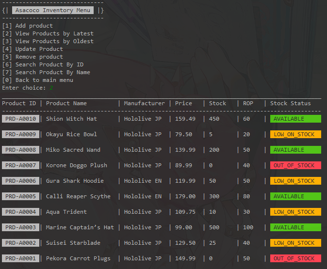

<table>
  <tr>
    <td rowspan="2"></img></td>
    <td colspan="5"><h1> UmiseaRetailConsole - SmartInventory and SalesManagementSystem </h1></td>
  </tr>
  <tr>
    <td colspan="5">
      <b>[INFO]</b>
      &nbspFeel free to copy the code — I don’t really care. If you want to make tweaks or notice anything that needs fixing, go ahead and let me know.
    </td>
  </tr>
</table>

## 🦐 System Diagram
// TODO: ADD A FLOWCHART SHOWCASING THE SYSTEM'S DESIGN

## 🦐 Requirements
### Product Management Module
- Add New Product
- View All Products (Forward and Backward Traversal)
- Update Product Details
- Delete Product
- Search Product by ID or Name

### Sales Management Module
- Record a Sale (automatically reduces stock in Product List)
- Display All Sales Records
- Delete a Sales Record (optional)
- Generate Sales Summary (Total Sales, Most Sold Product)

### Reports and Analytics Module
- View total number of products
- View total sales revenue
- Identify the product with the highest total sales
- Identify out-of-stock products

## 🦐 Limitations
There were no limitations mentioned in the given brief

## 🦐 Implementations
To foster a clean design, such concepts were implemented in the program
- Simple event-driven system
- Domain-driven design system
- MVC architecture
- OOP Principles
- Functional Interfaces

## 🦐 Program Screenshots
### Smart Inventory Module

### Sales Management Module

### Reports and Analytics Module

## 🦐 Possible improvements
Since codiva.io (an online compiler) can only hold a total of 3MB worth of files,
and I am limiting the complexity of the project,
implemented features were kept at the bare minimum. Shown below
are possible implementations you could do to better improve this
project!
- DIContainer class
- Bootstrap class
- Flexible presentation for n amount of records, n > 10 or 20
- Gateway implementation for event-driven architecture
- Add a sales record deletion method (purposely not added to make records unvoidable)
- Separate Validator classes
- Separate classes for event handlers instead of partial god-class managers

